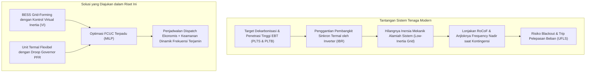
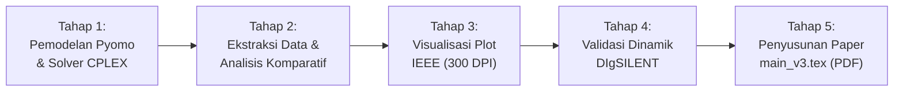

# 📑 Laporan Progres Riset Proyek Individual
## Frequency-Constrained Unit Commitment (FCUC) dengan Battery Virtual Inertia dan Regulasi Frekuensi pada Penetrasi EBT Tinggi

---

**Informasi Proyek & Tim Riset:**
* **Mahasiswa (Penulis 1):** Nathaniel Benelisha (NIM: Mahasiswa S1 Teknik Elektro, Semester 7)
* **Pendamping / Co-Mentor (S3):** Muhammad Aris Risnandar, S.T., M.T. (Kandidat Doktor Teknik Elektro UGM)
* **Dosen Pembimbing:** Ir. Lesnanto Multa Putranto, S.T., M.Eng., Ph.D., IPM., ASEAN Eng., SMIEEE  
  *(Lektor Kepala / Associate Professor, Departemen Teknik Elektro dan Teknologi Informasi, FT UGM)*
* **Institusi:** Departemen Teknik Elektro dan Teknologi Informasi (DTETI), Fakultas Teknik, Universitas Gadjah Mada
* **Luaran Ditargetkan:** Naskah Publikasi Ilmiah Jurnal Internasional Bereputasi (Target: IEEE Transactions on Power Systems / IEEE Access / Energies) sebagai Pengganti Skripsi / Tugas Akhir

---

## Executive Summary (Ringkasan Eksekutif)

Laporan ini disusun untuk mempresentasikan capaian progres riset Proyek Individual hingga September 2026, yang telah dikembangkan secara intensif melalui bimbingan bersama **Mas Aris**. Riset ini berfokus pada perancangan model optimasi operasional sistem tenaga listrik modern: **Frequency-Constrained Unit Commitment (FCUC)** yang mengintegrasikan unit termal, *Battery Energy Storage System* (BESS) penyedia *Virtual Inertia* (VI), serta penetrasi energi terbarukan intermiten berskala besar (PLTB 400 MW dan PLTS ~200 MW).

Dokumen ini merangkum:
1. **Latar Belakang & Urgensi Masalah** (*Low-inertia grid, RoCoF, & frequency stability issues*).
2. **Metode & Formulasi Matematis** (*Pyomo MILP + CPLEX Solver + DIgSILENT PowerFactory*).
3. **Progres yang Telah Dicapai** (Studi literatur 84 paper, implementasi kode, pembaruan formulasi, dan draf paper PDF hingga Draf 5).
4. **Desain Ulang 4 Skenario Simulasi Baru** (Inkremental, elegan, dan menyoroti peran PV & WT sebagai *pengotor* beserta *curtailment cost*).
5. **Rencana Kerja ke Depan (5 Tahapan Terstruktur)** menuju naskah final `main_v3.tex`.
6. **Poin Diskusi & Arahan** yang dimohonkan dari Dosen Pembimbing (Pak Lesnanto).

---

## 🎯 1. Latar Belakang & Permasalahan Riset



### 1.1 Permasalahan Pokok (*Problem Statement*)
1. **Dilema Penetrasi EBT dan Inersia Sistem:**
   Pembangkit EBT seperti PLTS fotovoltaik dan PLTB berbasis elektronika daya (*Inverter-Based Resources / IBR*) tidak memiliki massa berputar yang terhubung langsung secara sinkron ke kisi grid. Ketika daya EBT masuk menggantikan generator termal, **inersia ekivalen sistem merosot drastis**.
2. **Ancaman Keamanan Frekuensi:**
   Pada saat terjadi kontingensi hilangnya pembangkit terbesar ($N-1$), sistem dengan inersia rendah akan mengalami lonjakan laju perubahan frekuensi (*Rate of Change of Frequency / RoCoF*) yang sangat curam serta anjloknya frekuensi (*frequency nadir*) melewati batas ambang pelepasan beban (*Under-Frequency Load Shedding / UFLS* 49.0 Hz).
3. **Konflik Tekno-Ekonomi Unit Commitment Klasik:**
   Unit Commitment (UC) konvensional hanya meminimalkan biaya bahan bakar tanpa batasan frekuensi. Akibatnya, solver cenderung mematikan generator termal demi menghemat biaya, yang secara fatal menciptakan kondisi rawan gangguan frekuensi pada jam-jam penetrasi EBT tinggi.

---

## 📐 2. Metode Penelitian & Landasan Teori

### 2.1 Kerangka Metodologi Dua Tahap (*Two-Stage Framework*)
Riset ini menggabungkan optimasi matematis diskrit dengan validasi transien dinamis domain-waktu kontinu:
1. **Tahap 1 — Optimasi FCUC (Python Pyomo + IBM ILOG CPLEX 22.1.1):**
   Memformulasikan masalah sebagai *Mixed-Integer Linear Programming* (MILP) untuk menghasilkan keputusan biner status komitmen unit ($u_{g,t}$), tingkat output daya pembangkit ($P_{g,t}$), daya charging/discharging BESS ($P_{b,t}^{\text{ch}}, P_{b,t}^{\text{dis}}$), serta alokasi daya inersia virtual BESS ($P_{b,t}^{\text{VI}}$).
2. **Tahap 2 — Validasi Dinamik Transien (DIgSILENT PowerFactory):**
   Jadwal komitmen dan dispatch hasil CPLEX diuji pada model transien RMS dinamis (simulasi trip unit terbesar, jam beban rendah, dan variasi kontingensi) untuk memverifikasi kurva trayektori frekuensi $f(t)$ dan respon nadir secara nyata.

### 2.2 Sistem Uji (*Test System*)
* **Jaringan:** IEEE 24-bus Reliability Test System (RTS) yang disederhanakan menjadi sistem tembaga (*copper-plate equivalent*) 10 generator termal (G1–G10, kapasitas total 3.405 MW).
* **Profil Beban:** Kurva kebutuhan beban sistem 24 jam dengan beban rata-rata 1.168 MW dan beban puncak (*peak load*) 1.500 MW.
* **Integrasi EBT:**
  * **PLTB (Wind Turbine):** 100 unit turbin @ 4 MW (Kapasitas terpasang 400 MW).
  * **PLTS (Solar PV):** Profil radiasi harian dengan potensi daya puncak ~200 MW.
* **Integrasi BESS:** 2 unit BESS (B1 & B2) dengan kapasitas total 200 MW / 400 MWh.

### 2.3 Formulasi Kunci & Inovasi Pemodelan
1. **Kopling Alokasi Daya Konverter BESS (*Converter Headroom Coupling*):**
   Kapasitas maksimum konverter baterai ($DR_b^{\max}$) dialokasikan secara bersama antara penyaluran daya aktif (*discharging*) dan cadangan daya inersia virtual (*virtual inertia headroom*):
   $$P_{b,t}^{\text{dis}} + \frac{P_{b,t}^{\text{VI}}}{\eta_b^{\text{VI}}} \le DR_b^{\max} \cdot u_{b,t}^{\text{dis}}$$
2. **Inersia Total Sistem Terpadu ($H_{\text{sys}}$):**
   Inersia sistem menggabungkan inersia mekanik alami generator termal online dengan inersia virtual BESS:
   $$H_{\text{sys},t} = \sum_{g=1}^{10} H_g P_g^{\max} u_{g,t} + \sum_{b \in \text{BATT}} K_b^{\text{VI}} P_{b,t}^{\text{VI}}$$
3. **Batasan Keamanan RoCoF Linear:**
   $$2 \cdot \text{RoCoF}_{\lim} \cdot H_{\text{sys},t} \ge f_0 \cdot \text{LargestLoss}_t \quad (\text{RoCoF}_{\lim} = 0.55\text{ Hz/s})$$
4. **Penegasan Peran PV & WT sebagai "Pengotor" (Non-Virtual Inertia):**
   * PV dan WT dioperasikan pada inverter *grid-following* standar tanpa emulasi inersia ($H_{\text{pv}} = 0, H_{\text{wt}} = 0$).
   * Karena bukan VI, PV dan WT **tidak beroperasi secara *deloading***, melainkan dibiarkan menyuplai daya semaksimal mungkin (MPPT).
   * Jika daya EBT melebihi kemampuan serap sistem atau mengancam batas inersia minimum, maka kelebihan daya EBT **wajib di-*curtail* (dibuang)**, dan sistem menanggung **Curtailment Cost**:
     $$\text{Cost}_{\text{curt}} = \sum_{t=1}^{24} \left( C_{\text{curt}}^{\text{WT}} \cdot P_{\text{wt},t}^{\text{curt}} + C_{\text{curt}}^{\text{PV}} \cdot P_{\text{pv},t}^{\text{curt}} \right)$$

---

## 📈 3. Progres yang Telah Dicapai Sejauh Ini

Selama periode bimbingan intensif bersama Mas Aris, sejumlah tonggak capaian (*milestones*) utama telah diselesaikan:

| Bidang | Capaian Progres yang Telah Selesai | Status |
|:---|:---|:---:|
| **Koleksi & Review Literatur** | Telah mengumpulkan dan menelaah **84 paper akademik** bereputasi tinggi (IEEE Trans., Elsevier Applied Energy, dll.), termasuk kategorisasi paper kunci BESS VI (Fang 2021, Chu 2020, Xu 2018) dan paper regulasi frekuensi primer dari Pak Lesnanto / Candra (`[E02]` ICITEE 2020). | ✅ Selesai |
| **Arsitektur Pemodelan Pyomo** | Membangun kode Python Pyomo FCUC terintegrasi dengan antarmuka solver IBM CPLEX 22.1.1 (`cplex_direct`) dan validasi pembacaan data Excel. | ✅ Selesai |
| **Penyelarasan Formulasi Matematis** | Memperbaiki fungsi objektif menjadi biaya linear ($a_g u + b_g P$), memperbaiki persamaan alokasi daya converter BESS VI, menyelaraskan batasan inersia sistem, dan mengisolasi VI khusus ke BESS. | ✅ Selesai |
| **Penyusunan Manuskrip Paper** | Menyusun naskah manuskrip publikasi standar IEEEtran secara berkala dari **Draf 1 hingga Draf 5** (seluruh dokumen kompilasi PDF tersimpan rapi di folder `Paper/`). | ✅ Selesai |
| **Repositori & Dokumentasi** | Merapikan repositori GitHub, membersihkan dokumentasi folder, dan menyusun katalog referensi terstruktur. | ✅ Selesai |

---

## 🔄 4. Desain Ulang 4 Skenario Simulasi Baru (Fokus Diskusi Hari Ini)

Berdasarkan diskusi terakhir bersama Mas Aris, struktur simulasi yang sebelumnya terdiri dari 7 skenario telah **disederhanakan dan dirancang ulang menjadi 4 Skenario Inti Inkremental**. Tujuannya agar alur pembuktian ilmiah menjadi jauh lebih tegas, logis, dan mudah dipahami:

```
[Simulasi 1: UC Konvensional + Min Inertia] 
       │ (Baseline: 100% Inersia Termal SG, Beban Inersia Tinggi)
       ▼
[Simulasi 2: Simulasi 1 + BESS Standar] 
       │ (BESS Arbitrase Energi Saja, P_VI = 0, Inersia Masih 100% Termal)
       ▼
[Simulasi 3: Simulasi 2 + BESS Virtual Inertia] 
       │ (BESS VI Aktif, Substitusi Inersia Termal, Unit Mahal Berhasil Di-decommit)
       ▼
[Simulasi 4: Simulasi 3 + Variabel PV + WT (Sebagai Pengotor)] 
         (EBT Masuk Merusak Inersia, Uji Ketahanan BESS VI, Hitung Curtailment Cost)
```

### Matriks Perbandingan 4 Skenario Baru:
| Parameter Pemodelan | Simulasi 1 (Baseline FCUC) | Simulasi 2 (+ BESS Standar) | Simulasi 3 (+ BESS VI) | Simulasi 4 (+ PV & WT Pengotor) |
|:---|:---:|:---:|:---:|:---:|
| **Generator Termal (G1–G10)** | Aktif (10 unit) | Aktif (10 unit) | Aktif (10 unit) | Aktif (10 unit) |
| **Constraint Dasar UC (10 Konstrain)** | ✅ Aktif Penuh | ✅ Aktif Penuh | ✅ Aktif Penuh | ✅ Aktif Penuh |
| **Constraint RoCoF / Inersia Minimum** | ✅ Aktif ($\le 0.55\text{ Hz/s}$) | ✅ Aktif ($\le 0.55\text{ Hz/s}$) | ✅ Aktif ($\le 0.55\text{ Hz/s}$) | ✅ Aktif ($\le 0.55\text{ Hz/s}$) |
| **Regulasi Frekuensi Primer (PFR) & Batasan QSS** | ✅ **Aktif ($f_{\text{qss}} \ge 49.5\text{ Hz}$)** | ✅ **Aktif ($f_{\text{qss}} \ge 49.5\text{ Hz}$)** | ✅ **Aktif ($f_{\text{qss}} \ge 49.5\text{ Hz}$)** | ✅ **Aktif ($f_{\text{qss}} \ge 49.5\text{ Hz}$)** |
| **Penyedia Inersia Sistem** | **100% Termal SG** | **100% Termal SG** | **Termal SG + BESS VI** | **Termal SG + BESS VI** |
| **Operasi BESS (B1 & B2)** | ❌ Non-Aktif | ✅ Arbitrase Saja ($P^{\text{VI}} = 0$) | ✅ Arbitrase + VI Headroom | ✅ Arbitrase + VI Headroom |
| **Pembangkit EBT (PLTB & PLTS)** | ❌ Non-Aktif | ❌ Non-Aktif | ❌ Non-Aktif | ✅ **Aktif sebagai Pengotor** |
| **Inersia dari EBT** | 0 | 0 | 0 | **0 (Zero Inertia)** |
| **Curtailment Cost EBT** | \$0 | \$0 | \$0 | **✅ Dihitung & Diminimasi** |

> [!IMPORTANT]
> **Poin Kunci yang Dibuktikan:**
> 1. **Dua Dimensi Keamanan Frekuensi Terjamin di Seluruh Skenario:** Keempat simulasi secara konsisten mematuhi batasan **RoCoF** ($t = 0^+$, dijaga oleh inersia) dan batasan **Quasi-Steady-State (QSS)** ($t = 10\text{--}30\text{ s}$, dijaga oleh cadangan PFR *droop governor* generator termal dengan ambang batas $f_{\text{qss}} \ge 49.5\text{ Hz}$).
> 2. **Peran BESS VI (Sim 2 vs Sim 3):** Membuktikan bahwa BESS tanpa VI (Sim 2) tidak mampu mengurangi komitmen unit termal karena inersia sistem tetap defisit. Ketika fitur Virtual Inertia diaktifkan (Sim 3), unit termal berbiaya mahal dapat dimatikan (*de-committed*), menurunkan biaya bahan bakar secara signifikan tanpa melanggar RoCoF maupun QSS.
> 3. **Peran EBT sebagai Pengotor (Sim 3 vs Sim 4):** Membuktikan bahwa masuknya PV dan WT mendesak generator termal turun sehingga inersia inheren sistem anjlok drastis. Di sini diuji seberapa tangguh BESS VI menahan RoCoF, serta berapa besar energi EBT yang terpaksa di-*curtail* (beserta nilai kerugian ekonominya) agar batasan inersia dan QSS tetap terpenuhi.

---

## 🚀 5. Rencana Kerja ke Depan (5 Tahapan Terstruktur)

Untuk menuntaskan riset ini secara presisi dan bebas kesalahan (*no mistakes*), pekerjaan selanjutnya dibagi ke dalam **5 Tahapan Terstruktur**:



### Rincian Eksekusi Tiap Tahap:
1. **Tahap 1 — Pemodelan Pyomo & Eksekusi Solver CPLEX:**
   - Membangun skrip eksekutor baru `Coding/run_4_simulations.py`.
   - Mengimplementasikan model Solar PV (`PV_Available`, `PV_Curt`, batasan `PVCurtailmentLimit`) yang sebelumnya belum ada di Pyomo.
   - Mengaktifkan perhitungan `obj_curtailment_cost` pada fungsi objektif CPLEX.
   - Menjalankan ke-4 simulasi hingga status konvergensi *Optimal* (MIP gap $\le 0.1\%$).
2. **Tahap 2 — Ekstraksi Hasil & Analisis Komparatif:**
   - Menyusun tabel komparasi detail: Biaya bahan bakar, startup cost, curtailment cost, inersia rata-rata, dan worst RoCoF.
   - Menganalisis secara mendalam perbandingan **"Dengan PV-WT vs Tanpa PV-WT"** (efek pelemahan inersia dan pemanfaatan VI headroom).
3. **Tahap 3 — Pembuatan Visualisasi Grafik Standar IEEE (300 DPI):**
   - Menghasilkan 4 grafik publikasi beresolusi tinggi di `Paper/figures/`:
     - *Figure 1:* Stacked Generation Dispatch 24 jam (Thermal, BESS, WT, PV vs Load).
     - *Figure 2:* Profil Inersia Sistem ($H_{\text{sys}}$) & RoCoF 24 jam terhadap batas aman 0.55 Hz/s.
     - *Figure 3:* Operasi BESS (SOC, Discharging, dan Alokasi Daya VI Headroom).
     - *Figure 4:* Profil Potensi vs Daya Terserap vs Curtailment EBT.
4. **Tahap 4 — Validasi Transien Dinamis DIgSILENT PowerFactory:**
   - Mengimpor jadwal dispatch hasil optimasi MILP ke DIgSILENT PowerFactory.
   - Menjalankan simulasi domain-waktu (*RMS simulation*) untuk kontingensi $N-1$ trip unit terbesar pada jam beban puncak dan jam inersia terendah.
   - Memverifikasi respon frekuensi transien ($f(t)$, RoCoF transien, nadir compliance).
5. **Tahap 5 — Penyusunan Manuskrip Paper Baru (`Paper/main_v3.tex`) & PDF Draf Final:**
   - Menulis naskah publikasi ilmiah baru `Paper/main_v3.tex` (mempertahankan `main_v2.tex` sebagai arsip).
   - Memperbarui bab metodologi, formulasi matematika, tabel komparasi 4 skenario, dan grafik resolusi tinggi.
   - Mengompilasi naskah menjadi PDF Draf terbaru (`Paper/PI_Draf6.pdf` dan `LATEST_DRAFT.pdf`).

---

## 💬 6. Poin Diskusi & Permohonan Arahan kepada Dosen Pembimbing (Pak Lesnanto)

Pada sesi bimbingan ini, saya memohon masukan dan arahan dari Pak Lesnanto terkait:

1. **Penetapan Nilai Penalti Curtailment Cost ($C_{\text{curt}}$):**
   Apakah penggunaan nilai penalti curtailment sebesar \$30/MWh atau \$50/MWh sudah representatif dalam mencerminkan kerugian ekonomi pembuangan energi terbarukan di Indonesia/pasar daya modern?
2. **Kesesuaian Sistem Uji IEEE 24-bus RTS (10 Unit):**
   Apakah penyederhanaan sistem uji IEEE 24-bus menjadi model tembaga 10 generator sinkron sudah dipandang cukup kuat dan representatif untuk target jurnal bereputasi IEEE / MDPI, ataukah disarankan ada pengujian sensitivitas tambahan?
3. **Skenario Gangguan Transien di DIgSILENT:**
   Untuk validasi di DIgSILENT PowerFactory pada Tahap 4, apakah cukup difokuskan pada skenario kontingensi tunggal $N-1$ (trip generator terbesar, G1 400 MW), ataukah perlu ditambahkan simulasi transien saat jam penetrasi surya maksimum (jam 12.00–13.00)?
4. **Rekomendasi Target Jurnal:**
   Dengan struktur pembuktian 4 skenario baru dan validasi transien DIgSILENT ini, mohon arahan Bapak mengenai target outlet publikasi yang paling pas untuk disasar (misal: *IEEE Access*, *IEEE Transactions on Industry Applications*, atau *Energies*).

---

*Laporan ini disiapkan oleh: **Nathaniel Benelisha** (dengan pendampingan **Muhammad Aris Risnandar**) untuk Bimbingan Proyek Individual bersama **Ir. Lesnanto Multa Putranto, S.T., M.Eng., Ph.D.***
