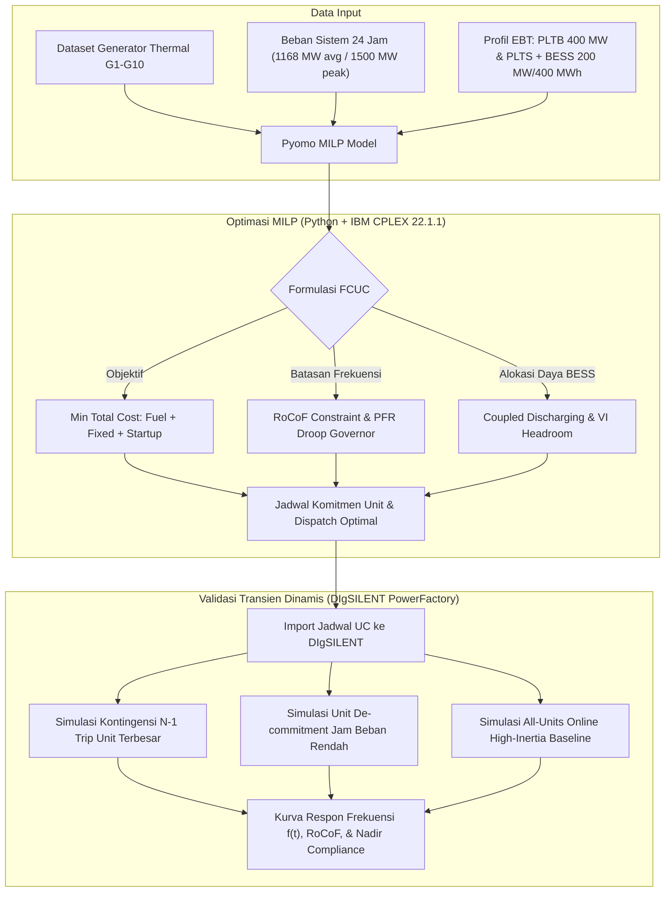

<!-- ═══════════════════════════════════════════════════════════════
     PROGRESS LOG — Untuk monitoring dosen pembimbing
     Update setiap kali ada progress baru yang di-push ke repo
     ═══════════════════════════════════════════════════════════════ -->

> [!NOTE]
> ## 📋 Progress Log — Last Updated: **24 September 2026**
>
> | Tanggal | Tahap | Status | Keterangan Singkat |
> |---|---|:---:|---|
> | 24 Sep 2026 | **Tahap 4** — Persiapan DIgSILENT N-1 | ✅ Done | Ekspor 9 dispatch CSV, 27 test cases, skrip otomasi Python API PF |
> | 24 Sep 2026 | **Tahap 3** — Visualisasi IEEE | ✅ Done | 10 figure PDF 300 DPI di `Paper/figures/` (cost, dispatch, UC heatmap, BESS VI, inertia, freq security, curtailment) |
> | 24 Sep 2026 | **Tahap 2** — Analisis Numerik | ✅ Done | Tabel komparasi biaya, inersia, UC; analisis mendalam S3 vs S4; penghematan S4 = $243,257 (5.74%) |
> | 23 Sep 2026 | **Tahap 1** — MILP 4 Skenario | ✅ Done | `run_4_simulations.py` v2; S1–S4 semua OPTIMAL via CPLEX 22.1.1 |
> | 21 Sep 2026 | Bimbingan Pak Lesnanto | ✅ Done | Review formulasi, pemodelan WT/PV sbg pengotor zero-inertia, rencana DIgSILENT |
>
> **Next:** Tahap 5 — Update manuskrip paper `Paper/main_v3.tex` dengan hasil 4 skenario & figures baru  
> **Oleh:** Nathaniel Benelisha &nbsp;|&nbsp; **Pembimbing:** Ir. Lesnanto Multa Putranto, Ph.D., IPM.

---

<p align="center">
  
</p>

# ⚡ Frequency-Constrained Unit Commitment with Battery Virtual Inertia & Primary Frequency Regulation

<p align="center">
  <a href="#-naskah-publikasi-terbaru-latest-draft"></a>
  <a href="https://www.python.org/"></a>
  <a href="http://www.pyomo.org/"></a>
  <a href="https://www.ibm.com/analytics/cplex-optimizer"></a>
  <a href="https://www.digsilent.de/"></a>
  <a href="https://www.overleaf.com/"></a>
  <a href="https://te.ft.ugm.ac.id/"></a>
</p>

---

## 📌 Informasi Proyek & Tim Peneliti

* **Judul Penelitian:** *Frequency-Constrained Unit Commitment with Battery Virtual Inertia and Primary Frequency Regulation under High Renewable Penetration*
* **Peneliti Utama (Penulis 1):** **Nathaniel Benelisha** (Departemen Teknik Elektro dan Teknologi Informasi, Universitas Gadjah Mada)
* **Ko-Peneliti (Penulis 2):** **Muhammad Aris Risnandar** (Mahasiswa Program Doktor Teknik Elektro, Universitas Gadjah Mada)
* **Dosen Pembimbing:** **Ir. Lesnanto Multa Putranto, S.T., M.Eng., Ph.D., IPM., ASEAN Eng., SMIEEE**  
  *(Lektor Kepala / Associate Professor — Sistem Tenaga Listrik, DTETI FT UGM)*
* **Institusi:** Departemen Teknik Elektro dan Teknologi Informasi, Fakultas Teknik, Universitas Gadjah Mada, Yogyakarta, Indonesia
* **Tujuan Luaran:** Publikasi Ilmiah Bereputasi Internasional (Pengganti Skripsi / Tugas Akhir S1)

---

## 📄 Naskah Publikasi Terbaru (Latest Draft)

> ### 📢 **MANUSKRIP TERAKHIR DAPAT DIAKSES LANGSUNG:**
> 
> Seluruh pembaruan paper ilmiah secara konsisten diunggah pada repositori ini:
> * 📥 **[Buka / Unduh Naskah Draf Terbaru: PI_Draf5.pdf (Klik Disini)](Paper/PI_Draf5.pdf)**
> * 🔗 **[Permanent Pointer: LATEST_DRAFT.pdf](Paper/LATEST_DRAFT.pdf)**
>
> *Status: **Draf 5 (Aktif)** — Penyelarasan formulasi biaya linear & PFR berdasarkan referensi `[E02]` ICITEE 2020, pemodelan inersia virtual khusus BESS dengan kopling alokasi daya discharging, neraca daya dengan PLTB & PLTS, serta validasi simulasi transien di DIgSILENT PowerFactory pada sistem IEEE 24-bus ekivalen 10 generator.*

---

## 🔬 Ringkasan Riset & Kebaruan Ilmiah (Novelty)

Peningkatan penetrasi pembangkit berbasis inverter (*Inverter-Based Resources* / IBR) seperti PLTS, PLTB, dan BESS menyebabkan berkurangnya inersia rotasi alami pada sistem tenaga listrik modern. Penurunan inersia ini memicu laju perubahan frekuensi awal (*Rate of Change of Frequency* / RoCoF) yang sangat curam serta penurunan nadir frekuensi yang berisiko memicu relai *Under-Frequency Load Shedding* (UFLS) saat terjadi gangguan pelepasan generator (kontingensi $N-1$).

Penelitian ini menghadirkan kerangka optimasi **Frequency-Constrained Unit Commitment (FCUC)** berbasis **Mixed-Integer Linear Programming (MILP)** dengan kebaruan utama:

1. **Inersia Virtual Khusus BESS & Kopling Alokasi Daya (*Headroom Coupling*):**  
   Inersia virtual disediakan secara terfokus oleh BESS melalui kendali inverter *grid-forming* ($H_{\text{BESS},t} = \sum_b K_b^{\text{VI}} P_{b,t}^{\text{VI}}$). Kapasitas konverter membatasi secara simultan alokasi daya *discharging* untuk energi dan *headroom* inersia virtual:
   $$P_{b,t}^{\text{dis}} + \frac{P_{b,t}^{\text{VI}}}{\eta_b^{\text{VI}}} \leq DR_b^{\max} u_{b,t}^{\text{dis}}$$
   Wind Turbine (PLTB) dan Solar PV (PLTS) beroperasi murni sebagai pemasok energi tanpa penyediaan inersia sintetis, sehingga menghindarkan turbin angin dari fenomena *secondary frequency dip* dan stres mekanis rotor.

2. **Primary Frequency Regulation (PFR) Lengkap & Droop Governor:**  
   Mengadopsi model regulasi frekuensi primer dari studi sistem Sulawesi Bagian Selatan (`[E02]` ICITEE 2020 / Restrepo & Galiana) dengan memperhitungkan karakteristik *droop speed governor*, batas kemampuan ramp respon primer, dan batas keamanan frekuensi *steady-state* ($\Delta f_t \geq \Delta f_{\text{ss}}^{\min}$), yang dilinearisasi secara eksak ke dalam MILP melalui amplop McCormick.

3. **Neraca Daya Terpadu Multi-Sumber:**  
   Mengintegrasikan unit thermal konvensional, BESS (pengisian/pengosongan), PLTB, dan PLTS dengan kemampuan *curtailment* dinamis.

4. **Metodologi Validasi Dua Tahap (Optimasi MILP + Transien DIgSILENT):**  
   Hasil jadwal komitmen unit ($u_{g,t}$) dan dispatch ($P_{g,t}, P_{b,t}^{\text{dis}}, P_{b,t}^{\text{VI}}$) dari IBM CPLEX diuji dan dibuktikan keandalannya dalam ranah waktu dinamis (*time-domain dynamic simulation*) pada software **DIgSILENT PowerFactory**.



---

## 📊 Hasil Benchmark & Perbandingan 7 Skenario

Model diuji pada 7 skenario konfigurasi batasan untuk mengukur trade-off antara efisiensi biaya dan keamanan dinamik sistem:

| Skenario | Konfigurasi Batasan | Biaya Total (USD/hari) | vs. Baseline (S1) | Inersia Rata-rata ($H_{\text{sys}}$) | Worst RoCoF (Hz/s) | Violasi RoCoF | Status Keamanan Frekuensi |
|:--------:|:--------------------|:----------------------:|:-----------------:|:------------------------------------:|:------------------:|:-------------:|:-------------------------:|
| **S1** | Classical UC (No Freq Constraints) | \$4,029,223 | $\pm$0.00% | 36,623 MWs | 0.903 | 24 / 24 jam | ❌ **Insecure** |
| **S2** | Classical UC + BESS | \$4,019,885 | −0.23% | 35,844 MWs | 0.831 | 24 / 24 jam | ❌ **Insecure** |
| **S3** | Classical UC + BESS + Wind | \$3,716,391 | −7.76% | 35,454 MWs | 0.831 | 24 / 24 jam | ❌ **Insecure** |
| **S4** | FCUC + Min Inertia (Inersia SG Saja) | \$4,176,358 | **+3.65%** | 42,980 MWs | 0.550 | 0 / 24 jam | ✅ **Secure** (Cost Penalty) |
| **S5** | FCUC + Min Inertia + Wind | \$3,944,158 | −2.11% | 42,980 MWs | 0.550 | 0 / 24 jam | ✅ **Secure** |
| **S6** | **FCUC + BESS Virtual Inertia (Rekomendasi)** | **\$3,938,983** | **−2.24%** | **43,216 MWs** | **0.550** | **0 / 24 jam** | **✅ Secure (Cost Saving)** |
| **S7** | FCUC + BESS-VI + WT-VI + QSS Limit | \$3,939,091 | −2.24% | 43,256 MWs | 0.550 | 0 / 24 jam | ✅ **Secure** |

### 💡 Temuan Utama (Key Takeaways):
* **Skenario 1 (Klasik) Sangat Rawan Gangguan:** RoCoF melanggar batas (0.55 Hz/s) pada seluruh 24 jam dengan nilai terburuk mencapai **0.903 Hz/s** (64% di atas batas izin).
* **Menjamin Inersia Hanya dengan Thermal (S4) Sangat Mahal:** Membutuhkan penalti biaya sebesar **+3.65% (+$147,135/hari)** akibat pemaksaan komitmen generator thermal yang mahal (*must-run units*).
* **BESS Virtual Inertia (S6) Memulihkan Keamanan & Menghemat Biaya:** Kontribusi rata-rata **236.5 MWs** inersia virtual dari BESS menyelesaikan seluruh violasi RoCoF sekaligus **menghemat 5.70% ($237,375/hari)** dibandingkan S4, bahkan beroperasi **2.24% lebih murah** dari UC klasik tanpa batasan frekuensi!

---

## ⚙️ Spesifikasi Sistem Pengujian (Test System)

Sistem uji didasarkan pada standar **IEEE 24-bus Reliability Test System (RTS-24)** yang disederhanakan (*aggregated/copper-plate model*) menjadi konfigurasi **10 Generator, 1 Bus ekivalen, dan 1 Beban agregat**:

* **10 Pembangkit Thermal Konvensional (G1--G10):**
  * **PLTU Batubara (G1, G3):** Kapasitas besar, inersia tinggi ($H = 4.0 - 5.0$ s), biaya rendah ($b = 16.19 - 16.60$ \$/MWh), waktu henti/nyala minimum panjang (8 jam).
  * **PLTGU Combined-Cycle (G2, G5):** Fleksibel, kapasitas menengah ($162 - 455$ MW), biaya sedang.
  * **PLTG / Diesel Peaking (G4, G6--G10):** Ramping cepat, inersia rendah ($H = 2.5 - 3.5$ s), biaya bahan bakar tinggi ($b = 22.26 - 27.79$ \$/MWh).
  * **Total Kapasitas Terpasang:** 1,662 MW.
* **Kebutuhan Beban Sistem:** Profil beban harian 24 jam dengan beban rata-rata 1,168 MW dan beban puncak 1,500 MW.
* **BESS Grid-Forming:** 200 MW / 400 MWh ($K_{\text{VI}}^{\text{BESS}} = 10$ MWs/MW, efisiensi charge/discharge 95%).
* **Pembangkit EBT:** PLTB 400 MW dan instalasi PLTS dengan profil potensi cuaca termultiplex.

---

## 🛠️ Validasi Transien Dinamis di DIgSILENT PowerFactory

Untuk memastikan hasil optimasi aljabar tidak hanya optimal di atas kertas melainkan stabil secara fisik, simulasi transien dinamis domain waktu (*RMS time-domain simulation*) dijalankan pada **DIgSILENT PowerFactory** mencakup tiga kondisi kritis:

1. **Kondisi Kontingensi $N-1$ (*Trip Generator Terbesar*):**
   * Mensimulasikan pelepasan mendadak generator terbesar ($P^{\text{loss}}$) pada jam beban puncak dan jam inersia terendah.
   * Menghasilkan kurva $f(t)$ untuk membuktikan bahwa nadir frekuensi berada di atas ambang batas relai UFLS Indonesia (49.0 Hz) dan respon droop governor bekerja tepat waktu.
2. **Kondisi Unit Dimatikan (*De-commitment / Valley Load*):**
   * Menguji kondisi ketika pembangkit thermal dimatikan karena penetrasi EBT tinggi pada jam beban rendah.
   * Membuktikan bahwa inersia virtual BESS mampu meredam laju penurunan frekuensi awal.
3. **Kondisi Semua Unit Menyala (*High-Inertia Baseline*):**
   * Memvalidasi respon transien dan peredaman osilasi saat seluruh generator sinkron aktif sebagai batas atas kestabilan sistem.

---

## 📂 Struktur Repositori

```
📁 Proyek-Individu_NathanielBenelisha/
│
├── 📄 README.md                            # Dokumentasi utama proyek (halaman ini)
├── 📄 .gitignore                           # Konfigurasi file yang diabaikan Git
├── 📄 persiapan_bimbingan.md               # Catatan komprehensif review literatur & persiapan bimbingan
│
├── 📁 Paper/                               # Naskah manuskrip publikasi ilmiah & dokumen PDF
│   ├── 📥 PI_Draf5.pdf                     # ⭐ Draf naskah paper terbaru (Draf 5)
│   ├── 🔗 LATEST_DRAFT.pdf                 # Mirror pointer ke draf mutakhir
│   ├── 📄 PI_Draf1.pdf s.d. PI_Draf4.pdf  # Arsip riwayat draf naskah sebelumnya
│   ├── 📁 figures/                         # Gambar, diagram grafis, dan plot respon sistem
│   └── 📄 README.md                        # Dokumentasi folder Paper
│
├── 📁 Coding/                              # Source code, notebook, & dataset
│   ├── 📄 Coba_16_20260612_R00_*.ipynb     # Notebook Pyomo MILP utama (CPLEX direct)
│   ├── 📄 DataSet_ModifikasiCandra_R02.xlsx# Dataset 10 unit thermal, beban, PLTB, PLTS, & BESS
│   ├── 📄 Hasil_UC_WT_Battery.xlsx         # Hasil ekspor numerik 7 skenario simulasi
│   ├── 📁 Presentasi/                      # Slide presentasi progres bimbingan (PPTX)
│   └── 📄 README.md                        # Dokumentasi folder Coding
│
├── 📁 Referensi/                           # Koleksi literatur akademik (84 paper PDF)
│   ├── 📁 Full Referensi/                  # Koleksi paper lengkap berkategori [01-xxx] s.d. [E02-xxx]
│   ├── 📁 Unit Commitment/                 # Literatur fundamental & formulasi UC
│   └── 📄 README.md                        # Katalog lengkap referensi & sitiran
│
└── 📁 CAPSTONE/                            # Dokumen perancangan Capstone Design terkait
    └── 📄 README.md                        # Dokumentasi folder Capstone
```

---

## 📈 Roadmap & Progres Penelitian (Pipeline 5 Tahap)

> **Pipeline aktif** berdasarkan rencana bimbingan September 2026

- [x] **Tahap 1:** Implementasi MILP 4 Skenario — `run_4_simulations.py` v2 dengan pemodelan PV & WT pengotor, batasan QSS & PFR, solver CPLEX. Semua 4 skenario **OPTIMAL**.
- [x] **Tahap 2:** Ekstraksi hasil numerik — tabel komparasi biaya, inersia, unit commitment, dispatch BESS; analisis mendalam S3 vs S4.
- [x] **Tahap 3:** Visualisasi IEEE — 10 figure publikasi (300 DPI, PDF) di `Paper/figures/`: cost, dispatch stack, UC heatmap, BESS VI, inertia/RoCoF, freq security, curtailment, SOC, reserve.
- [x] **Tahap 4:** Persiapan DIgSILENT — 9 dispatch CSV + 27 test cases N-1 contingency; skrip otomasi Python API PowerFactory 2024.
- [ ] **Tahap 5:** Update manuskrip `Paper/main_v3.tex` dengan tabel, figures, dan analisis hasil 4 skenario.

*(Pipeline lama — arsip referensi):*
- [x] ~~Tahap A:~~ Formulasi MILP FCUC Pyomo + CPLEX (notebook)
- [x] ~~Tahap B:~~ Eksekusi 7 skenario numerik + analisis tekno-ekonomi
- [x] ~~Tahap C:~~ Penyelarasan formulasi biaya & PFR (ref. ICITEE 2020)
- [x] ~~Tahap D:~~ Pemodelan inersia virtual BESS + converter headroom coupling
- [x] ~~Tahap E:~~ Integrasi neraca daya multi-sumber (PV, WT)
- [x] ~~Tahap F:~~ Penyusunan manuskrip IEEEtran (Draf 1–5)
- [ ] **Tahap G:** Simulasi transien DIgSILENT (lanjutan Tahap 4)
- [ ] **Tahap H:** Finalisasi & submit jurnal/konferensi IEEE

---

## 📂 Struktur Repositori

```
📁 Proyek-Individu_NathanielBenelisha/
│
├── 📄 README.md                            # Dokumentasi utama & progress log
├── 📄 Desain_4_Simulasi_FCUC.md           # Desain 4 skenario simulasi MILP
├── 📄 Laporan_Progres_Bimbingan_Pak_Lesnanto.md
│
├── 📁 Bimbingan/                           # Dokumentasi bimbingan & laporan
│   ├── 📄 README.md
│   ├── 📄 Analisis_Tahap2_FCUC.md         # ⭐ Laporan analisis 4 skenario
│   ├── 📄 Analisis_Hasil_4_Simulasi.xlsx  # Data numerik lengkap
│   └── 📄 Tahap4_DigSilent_Guide.md       # Panduan DIgSILENT N-1
│
├── 📁 Paper/                               # Naskah manuskrip & figures
│   ├── 📥 PI_Draf5.pdf                     # ⭐ Draf terbaru
│   ├── 🔗 LATEST_DRAFT.pdf
│   ├── 📁 figures/                         # ⭐ 10 IEEE figures (300 DPI PDF)
│   │   ├── fig1_cost_comparison.pdf
│   │   ├── fig2_dispatch_S1.pdf
│   │   ├── fig3_dispatch_S4.pdf
│   │   ├── fig4_uc_heatmap.pdf
│   │   ├── fig5_bess_vi.pdf
│   │   ├── fig6_inertia_rocof.pdf
│   │   ├── fig7_freq_security_S3vsS4.pdf
│   │   ├── fig8_curtailment_S4.pdf
│   │   ├── fig9_bess_soc_vi.pdf
│   │   └── fig10_reserve_profile.pdf
│   └── 📄 README.md
│
├── 📁 Coding/                              # Source code & dataset
│   ├── 📄 run_4_simulations.py            # ⭐ MILP 4 skenario (Tahap 1)
│   ├── 📄 analyze_4_simulations.py        # Analisis numerik (Tahap 2)
│   ├── 📄 plot_4_simulations.py           # IEEE figures (Tahap 3)
│   ├── 📄 export_dispatch_for_digsilent.py# Ekspor data UC → DIgSILENT
│   ├── 📄 digsilent_n1_contingency.py     # Otomasi PF Python API (Tahap 4)
│   ├── 📄 Hasil_UC_4_Simulasi_Summary.xlsx# Data hasil 4 skenario (5 sheet)
│   ├── 📄 Analisis_Hasil_4_Simulasi.xlsx  # Data analisis (6 sheet)
│   ├── 📄 DataSet_ModifikasiCandra_R02.xlsx# Dataset parameter sistem
│   ├── 📄 Coba_16_20260612_R00_*.ipynb    # Notebook utama (referensi)
│   └── 📁 DigSilent/                      # Data & test cases DIgSILENT
│       ├── dispatch_critical_hours.xlsx
│       ├── contingency_test_matrix.csv    # 27 N-1 test cases
│       ├── dispatch_S1/S3/S4_t*.csv      # 9 snapshot kondisi awal
│       └── Results/                       # Output simulasi transien
│
├── 📁 DigSilent/                           # Mirror data DIgSILENT (Tahap 4)
├── 📁 Referensi/                           # Koleksi literatur (84 paper)
└── 📁 CAPSTONE/                            # Dokumen Capstone Design
```

---

## 🚀 Panduan Menjalankan Simulasi (Reproducibility)

### 1. Kloning Repositori
```bash
git clone https://github.com/NathanielBenelisha-UGM/Proyek-Individu_NathanielBenelisha.git
cd Proyek-Individu_NathanielBenelisha
```

### 2. Konfigurasi Lingkungan Python
```bash
# Buat virtual environment
python -m venv venv
# Aktivasi di Windows:
.\venv\Scripts\activate

# Instal dependensi yang dibutuhkan
pip install pyomo openpyxl pandas numpy matplotlib jupyter
```
*Catatan: Solver IBM ILOG CPLEX (v22.1.1) harus terinstal pada sistem dan dapat diakses melalui antarmuka `cplex_direct`.*

### 3. Menjalankan Model UC di Jupyter Notebook
Buka dan jalankan notebook:
```bash
jupyter notebook "Coding/Coba_16_20260612_R00_vinertia_cplexdirect.ipynb"
```

### 4. Mengakses Naskah Paper
File PDF draf publikasi ilmiah terbaru dapat diakses dan diunduh langsung dari direktori:
```
Paper/PI_Draf5.pdf  (atau Paper/LATEST_DRAFT.pdf)
```

---

## 📝 Sitiran & Hak Cipta

Jika Anda menggunakan model, data, atau formulasi dari penelitian ini, mohon mencantumkan sitiran:

```bibtex
@article{Benelisha2026FCUC,
  author    = {Nathaniel Benelisha and Muhammad Aris Risnandar and Lesnanto Multa Putranto},
  title     = {Frequency-Constrained Unit Commitment with Battery Virtual Inertia and Primary Frequency Regulation under High Renewable Penetration},
  journal   = {Under Review / Working Draft},
  year      = {2026},
  institution = {Universitas Gadjah Mada}
}
```

<p align="center">
  <b>Departemen Teknik Elektro dan Teknologi Informasi</b><br>
  Fakultas Teknik, Universitas Gadjah Mada<br>
  Yogyakarta, Indonesia
</p>
